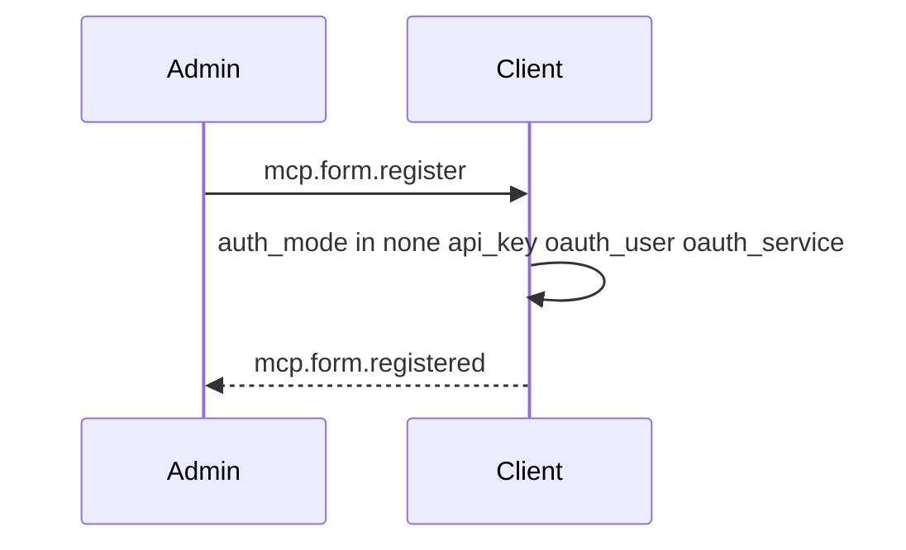
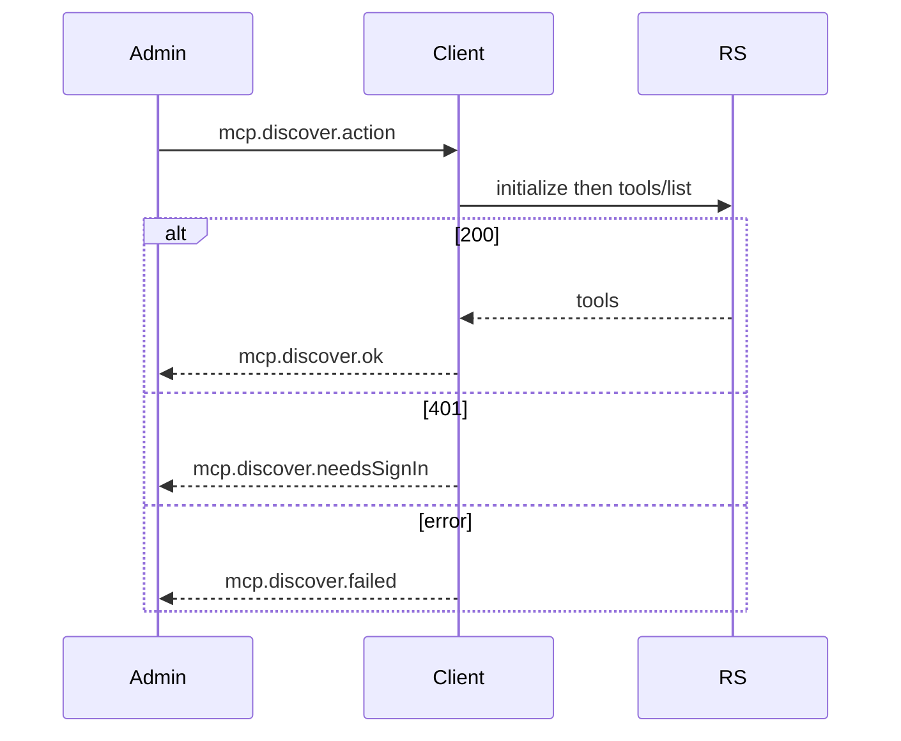
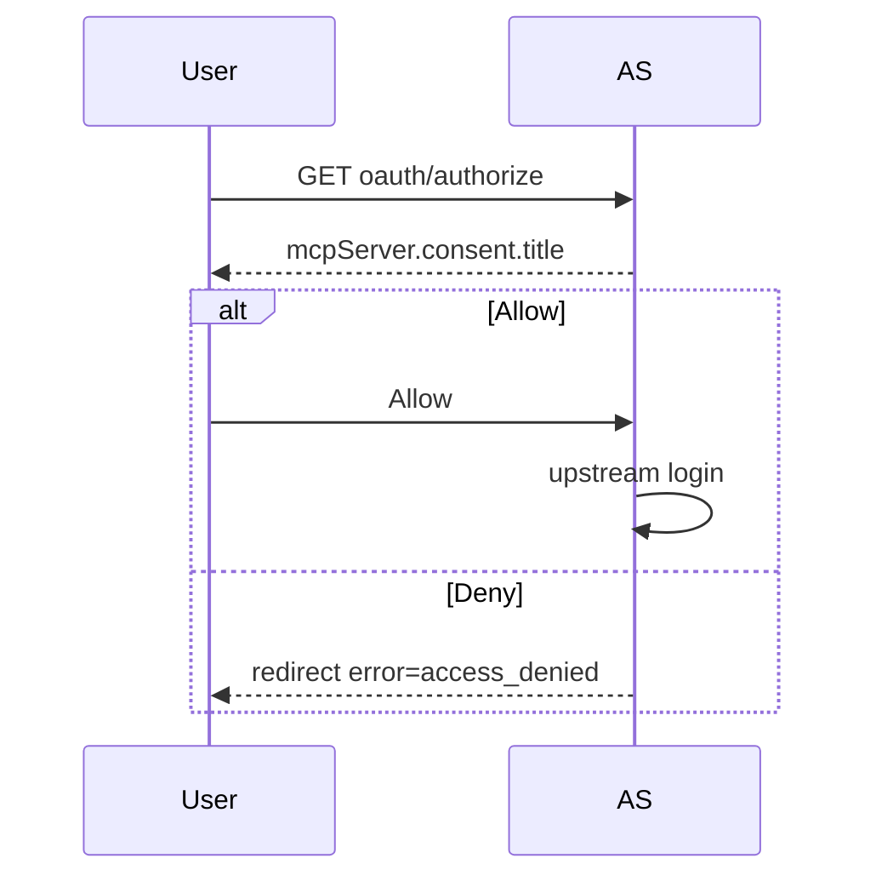

# MCP flows

Actors: Admin, Employee (the digital employee), User, Client (Digital Employees), RS (resource server), AS (authorization server). UI keys are in [mcp-strings.json](mcp-strings.json).

## 1. Register a tool server

State: row in `mcp_servers`, `discovery_status` null.

## 2. Discovery and test

`discovery_status`: `ok`, `needs_sign_in`, or `failed`.

When the server is assigned to an employee, each newly discovered tool gets Allow if `readOnlyHint` is true and `destructiveHint` is not true, otherwise Ask. An existing row is not overwritten. Deny applies only to a server that is not assigned.

## 3. First use in chat

Private chat uses `mcp.chat.signInPrivate` and includes the one-time URL. A group chat uses `mcp.chat.signInGroup` and never includes the URL.

## 4. Consent

The page shows `mcpServer.consent.client`, `redirectHost`, and `loopbackWarning` when the host is loopback. It uses the shared card in [auth-pages.md](auth-pages.md).

## 5. Identity binding

After the token is stored, the client calls `<prefix>_whoami` and compares `email` to the expected address. A mismatch clears the token and shows `mcp.callback.wrongAccountTitle`.

## 6. Silent refresh

The client refreshes before `expires_at`. The new refresh token replaces the old one. If the response has no refresh token, the stored one is kept. Failure clears the connection and the next call uses flow 3.

## 7. Step-up

HTTP 403 with `error="insufficient_scope"` starts one new authorization per server per principal per hour, with the accumulated scopes. A second 403 in that hour is shown as an error.

## 8. Revoke

The client roster calls `mcp.principals.revoke` (`mcp-oauth` `revokePrincipal`). The server admin tab calls `POST /admin/connections/:id/revoke`. Both delete the token. State: `revoked`.

## 9. Service OAuth 2.1

`auth_mode=oauth_service`. The client posts `grant_type=client_credentials` with `resource`. Tokens live in `mcp_service_tokens`. No consent page and no chat link.

## 10. API key

`auth_mode=api_key`. The client sends `Authorization: Bearer <key>` from `mcp_server_secrets`. No OAuth.

## 11. Ask approval

A call whose effective policy is `ask` is stored as `mcp_tool_calls.status=pending`. The employee run waits. Admin uses `mcp.tab.approve` or `mcp.tab.reject`, which sets `succeeded`/`rejected` after the call runs, or `rejected`.

## 12. Session lost and circuit open

HTTP 404 with `Mcp-Session-Id` makes the client `initialize` again. That retry does not count as a failure.

Five consecutive availability failures open the circuit for five minutes. The user sees `mcp.chat.circuitOpen`. These count: a transport error, HTTP 5xx, a timeout, and a network failure from fetch. These do not: a JSON-RPC error, a tool result with `isError: true` (the server answered), HTTP 401, and HTTP 403.

## 13. External client (Claude, Cursor, Dust)

The client discovers the resource, registers (CIMD, else dynamic registration) with an allowlisted exact redirect, shows the consent page, then calls tools with the bearer token. Refresh rotates.

## 14. External server into Digital Employees

Admin registers the URL and an auth type, runs discovery, and fills Agent usage notes when the server sends no `instructions`. After the server is assigned, new tools take the annotation default (Allow when read-only, otherwise Ask). Deny is the default only while the server is not assigned.
