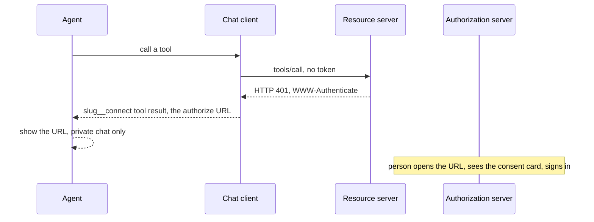

# User MCP (`oauth_user`)

Each person signs in as themselves. Authorization code + PKCE (OAuth 2.1), discovered through RFC 9728 and RFC 8414. This is the default for any server that returns one person's CRM, mail, or accounting data.

## How the sign-in link reaches the person

A Matrix chat has no browser of its own, so the link travels inside the agent's reply.



1. The server answers **401** with `resource_metadata` and `scope` (RS-2). It never writes a URL into a tool result (T-11).
2. The chat client registers a synthetic `<slug>__connect` tool for each `oauth_user` server that this person has not connected (C-19). The tool's result is the one-time authorize URL.
3. In a private chat the agent shows that URL. In a group chat the result says to switch to a private chat and contains no URL.
4. The browser page is the shared card ([auth-pages.md](../auth-pages.md)): consent, then the upstream login, then the client's landing page.

## Server

| Step | Rule |
|---|---|
| Protected Resource Metadata, 401 challenge, `invalid_token`, `insufficient_scope`, audience | RS-1 … RS-7 |
| Authorization server: metadata, PKCE S256, exact redirect, `resource`, refresh rotation, 1 hour access tokens, revoke, consent, rate limits | AS-1 … AS-12 |
| `<prefix>_whoami` returns `{ email, user_id, display_name, scope }` | [tools.md](../tools.md) |
| No `<prefix>_sign_in` or `<prefix>_sign_out` tool | T-11 |

Consent is remembered per user and `client_id` only when the authorization server can recognise the returning user before the upstream login (AS-10). A credential form with no session cookie shows consent every time.

## Client

Follow C-1 … C-19. Registration order is pre-registered client, then CIMD, then dynamic registration (C-11). After the callback, call `<prefix>_whoami` and compare `email` when `identityProbe` is set.

`auth_config`:

```json
{ "presetClientId": "optional", "scopes": ["optional"], "identityProbe": { "tool": "<prefix>_whoami", "emailPath": "email" } }
```

## Probe

```bash
node tools/mcp-conformance/probe.mjs https://intranet.sharpsir.group/msa/mcp --scenario oauth_user
```

## Reference

Server with a built-in authorization server: `gca-ltd/matrix-sa-mcp`.
Server with a separate authorization server: `gca-ltd/qobrix-crm-mcp` + `gca-ltd/qobrix-crm-mcp-oauth`.
Client: `gca-ltd/matrix-digital-employees` (`buildConnectTools` in `supabase/functions/_shared/agent-tools.ts`).
